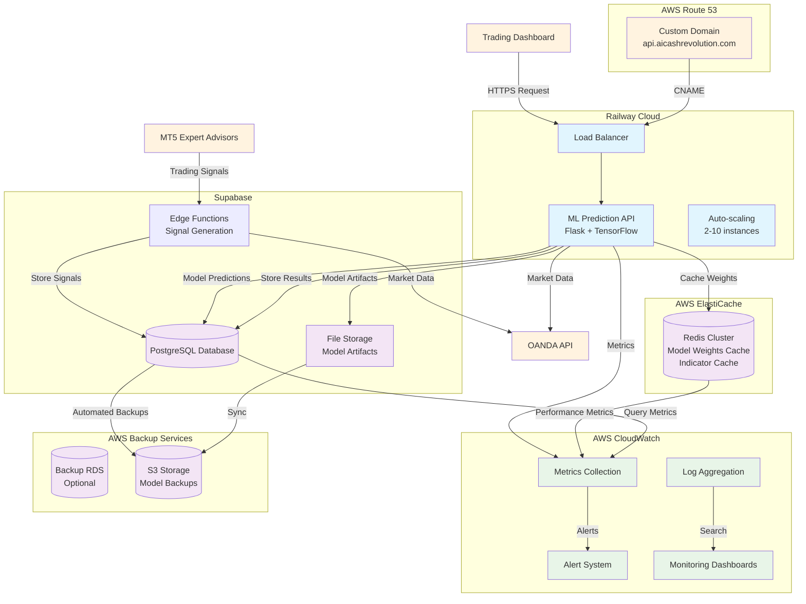
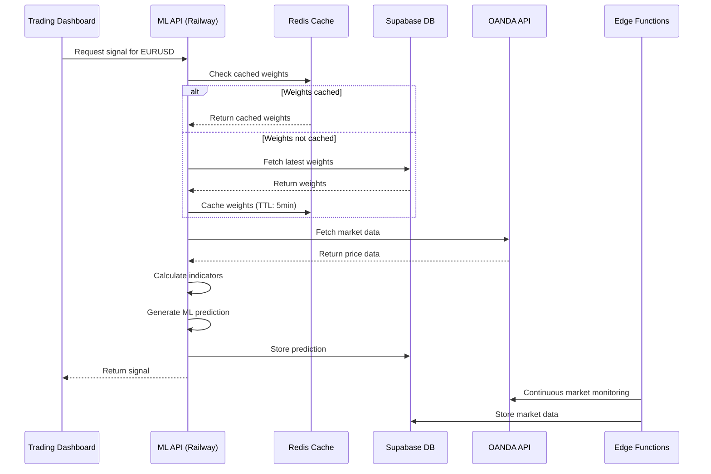
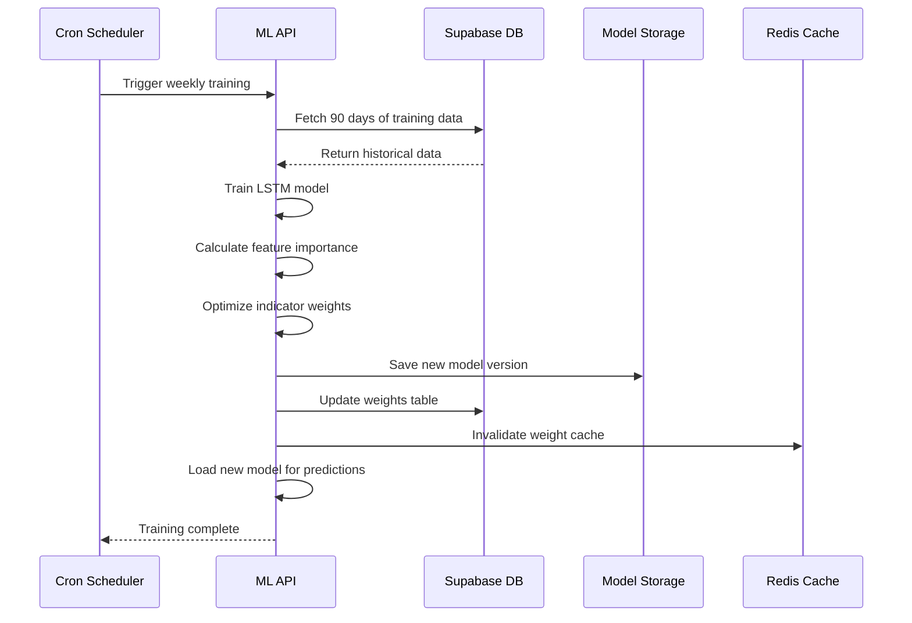
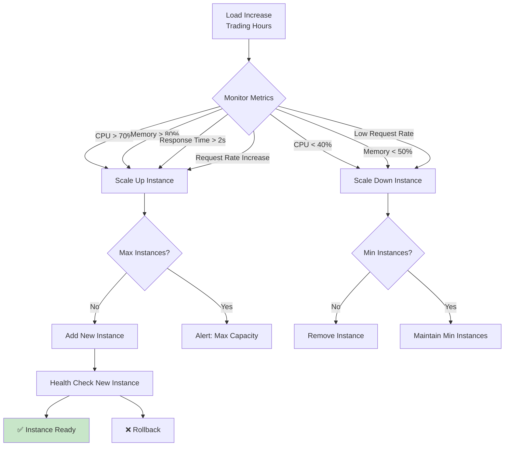

# Infrastructure Architecture Diagram

## Complete ML Trading System Architecture

## Component Interactions

### 1. Real-time Trading Signal Flow

### 2. Model Training Pipeline

### 3. Auto-scaling Behavior

## Infrastructure Cost Analysis

### Monthly Cost Breakdown

| Service | Tier | Monthly Cost | Purpose |
|---------|------|--------------|---------|
| Railway ML Service | Pro + Auto-scaling | $60 | ML model serving |
| Supabase Database | Pro | $25 | Primary database |
| Supabase Functions | Pay-as-you-go | $5 | Signal generation |
| AWS ElastiCache (Redis) | cache.t3.micro | $25 | Caching layer |
| AWS CloudWatch | Basic | $10 | Monitoring |
| Custom Domain | Route 53 | $1 | DNS management |
| **Total** | | **$126** | **Production Infrastructure** |

### Cost Optimization Strategies

1. **Auto-scaling**: Pay only for resources used
2. **Caching**: Reduce database queries by 80%
3. **Scheduled Scaling**: Reduce instances during off-hours
4. **Model Optimization**: Quantize models to reduce memory usage
5. **Data Retention**: Archive old data to cheaper storage

## Security Architecture

### Network Security
- **HTTPS Only**: All traffic encrypted with TLS 1.3
- **Private Endpoints**: Database connections via private networks
- **VPC Isolation**: Redis and backup DB in isolated VPC
- **Firewall Rules**: Restrict access to necessary services only

### Application Security
- **API Keys**: Secure storage in Railway secrets
- **Database Authentication**: Service role keys with least privilege
- **Rate Limiting**: Prevent API abuse and DDoS
- **Input Validation**: Sanitize all user inputs

### Data Security
- **Encryption at Rest**: All data encrypted in databases
- **Encryption in Transit**: All API calls encrypted
- **Access Logs**: Comprehensive audit trail
- **Backup Encryption**: Encrypted backups in S3

## Disaster Recovery Plan

### RTO (Recovery Time Objective): 15 minutes
### RPO (Recovery Point Objective): 5 minutes

### Backup Strategy
1. **Database**: Automated daily backups + point-in-time recovery
2. **Model Artifacts**: Versioned storage in Supabase + S3
3. **Configuration**: Git version control + Infrastructure as Code
4. **Application**: Blue-green deployment strategy

### Recovery Procedures
1. **Service Outage**: Auto-scaling + health checks
2. **Database Failure**: Failover to read replica + restore from backup
3. **Model Corruption**: Rollback to previous version
4. **Region Outage**: Manual failover to secondary region

## Performance Optimization

### Response Time Targets
- **API Predictions**: <500ms (95th percentile)
- **Database Queries**: <100ms average
- **Cache Hits**: <10ms
- **Model Loading**: <2s initial, then cached

### Caching Strategy
- **Model Weights**: 5-minute TTL in Redis
- **Technical Indicators**: 1-minute TTL
- **Market Data**: 30-second TTL
- **API Responses**: 1-minute TTL for identical requests

### Database Optimization
- **Connection Pooling**: 2-20 connections per service
- **Read Replicas**: Reporting queries to replicas
- **Indexing Strategy**: Optimized for symbol + timestamp queries
- **Query Optimization**: Prepared statements and batch operations

## Monitoring & Alerting Strategy

### Key Performance Indicators (KPIs)
1. **System Health**: Uptime >99.9%
2. **API Performance**: Response time <500ms
3. **Model Accuracy**: Win rate >65%
4. **Cost Efficiency**: <$200/month total

### Alert Thresholds
- **Critical**: Service down, error rate >10%
- **Warning**: High CPU/memory, slow response times
- **Info**: Low prediction volume, cache misses

### Dashboard Views
1. **Executive Overview**: System health, costs, performance
2. **Technical Details**: Metrics, logs, traces
3. **Trading Performance**: Win rates, profit/loss, signal quality
4. **Infrastructure**: Resource utilization, scaling events

This architecture provides a robust, scalable, and cost-effective foundation for your ML trading system, capable of handling real-time trading operations with high reliability and performance.